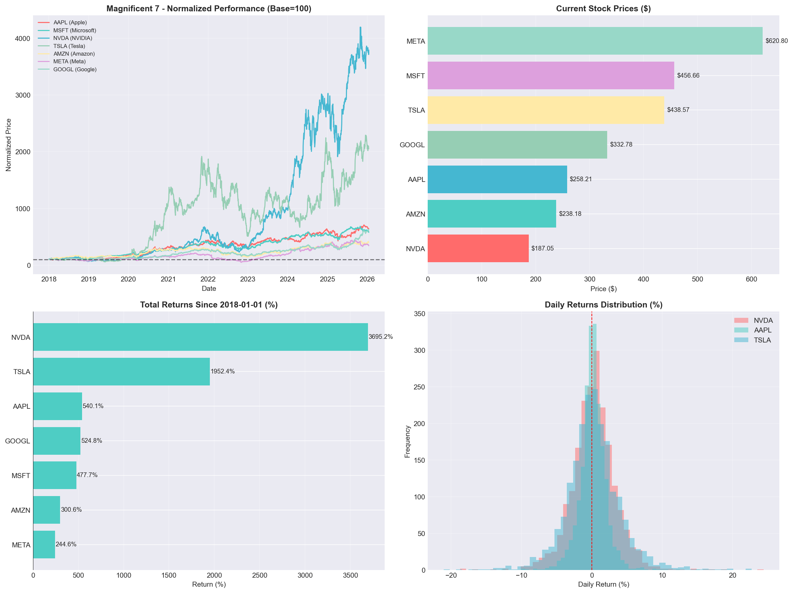
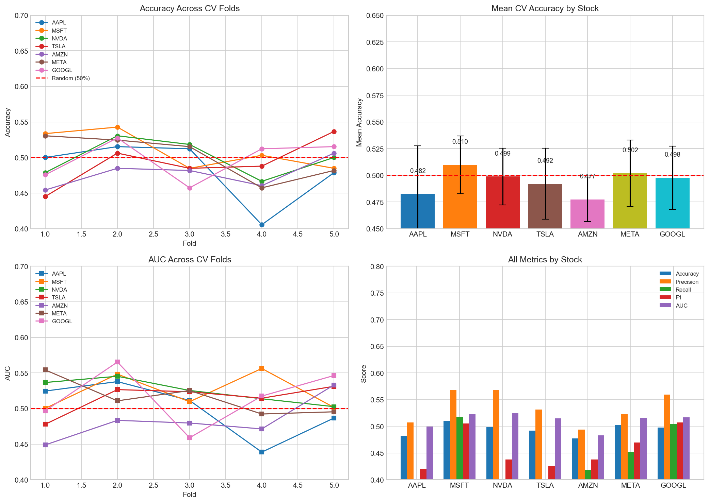
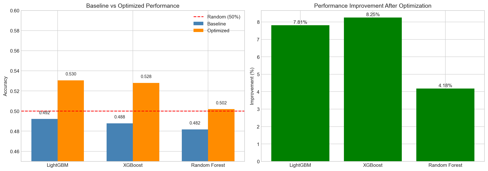
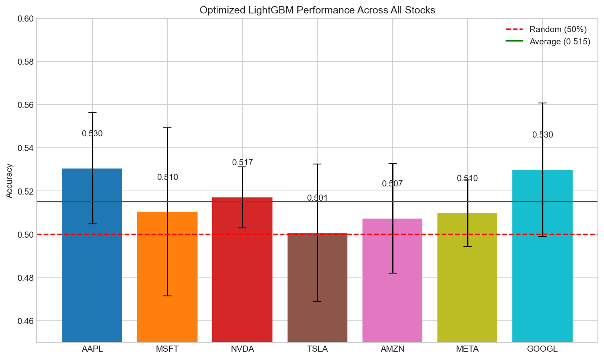

# 📈 Stock Prediction Dashboard - Magnificent 7

[](https://share.streamlit.io)
[](https://www.python.org/downloads/)
[](https://opensource.org/licenses/MIT)

An interactive dashboard for stock price prediction of the **Magnificent 7** tech stocks using Machine Learning.



## 🎯 Project Overview

This project implements an end-to-end **Data Full Stack** methodology for stock price direction prediction:

| Stock | Company | Sector |
|-------|---------|--------|
| AAPL | Apple Inc. | Technology |
| MSFT | Microsoft Corporation | Technology |
| NVDA | NVIDIA Corporation | Semiconductors |
| TSLA | Tesla, Inc. | Automotive/Energy |
| AMZN | Amazon.com, Inc. | E-commerce/Cloud |
| META | Meta Platforms, Inc. | Social Media |
| GOOGL | Alphabet Inc. | Technology |

## 🏗️ Project Structure

```
Stock-Prediction-Dashboard/
├── 📂 app/
│   └── streamlit_app.py          # Main Streamlit dashboard
├── 📂 data/
│   ├── raw/                      # Original stock data
│   ├── cleaned/                  # Cleaned datasets
│   ├── features/                 # Engineered features
│   └── processed/                # EDA outputs
├── 📂 notebooks/
│   ├── 01_data_acquisition.ipynb # Step 1: Data collection
│   ├── 02_eda.ipynb              # Step 2: Exploratory analysis
│   ├── 03_cleaning.ipynb         # Step 3: Data cleaning
│   ├── 04_feature_engineering.ipynb # Step 4: Feature creation
│   ├── 05_modeling.ipynb         # Step 5: Model training
│   ├── 06_pipeline.ipynb         # Step 6: ML pipeline
│   ├── 07_validation.ipynb       # Step 7: Model validation
│   └── 08_optimization.ipynb     # Step 8: Hyperparameter tuning
├── 📂 models/                    # Trained models
├── 📂 optimization/              # Optimized models
├── 📂 pipeline/                  # Production pipelines
├── 📂 validation/                # Validation results
├── 📂 tests/                     # Unit tests
├── 📂 deploy/                    # Deployment guides
├── requirements.txt              # Python dependencies
└── README.md                     # This file
```

## 🚀 Quick Start

### Prerequisites

- Python 3.11+
- pip

### Installation

```bash
# Clone the repository
git clone https://github.com/Jonmaa/Stock-Prediction-Dashboard.git
cd Stock-Prediction-Dashboard

# Create virtual environment
python -m venv .venv

# Activate virtual environment
# Windows:
.venv\Scripts\activate
# Linux/Mac:
source .venv/bin/activate

# Install dependencies
pip install -r requirements.txt
```

### Run the Dashboard

```bash
streamlit run app/streamlit_app.py
```

Open your browser at: **http://localhost:8501**

## 📊 Methodology: Data Full Stack (11 Steps)

| Step | Description | Notebook |
|------|-------------|----------|
| 1 | **Data Acquisition** - Collect stock data via yfinance | `01_data_acquisition.ipynb` |
| 2 | **Exploratory Data Analysis** - Understand data patterns | `02_eda.ipynb` |
| 3 | **Data Cleaning** - Handle missing values, outliers | `03_cleaning.ipynb` |
| 4 | **Feature Engineering** - Create 50+ technical indicators | `04_feature_engineering.ipynb` |
| 5 | **Modeling** - Train LightGBM classifiers | `05_modeling.ipynb` |
| 6 | **Pipeline** - Build production-ready ML pipelines | `06_pipeline.ipynb` |
| 7 | **Validation** - Cross-validation & backtesting | `07_validation.ipynb` |
| 8 | **Optimization** - Hyperparameter tuning | `08_optimization.ipynb` |
| 9 | **Streamlit** - Interactive dashboard | `app/streamlit_app.py` |
| 10 | **Deployment** - Streamlit Cloud deployment | `deploy/` |
| 11 | **Documentation** - This README | - |

## 🤖 Machine Learning Model

### Model: LightGBM Classifier

**Optimized Hyperparameters:**
```python
{
    'learning_rate': 0.01,
    'n_estimators': 50,
    'max_depth': 3,
    'num_leaves': 15,
    'min_child_samples': 20
}
```

### Features (50+)

| Category | Features |
|----------|----------|
| **Trend** | SMA, EMA, MACD, ADX |
| **Momentum** | RSI, Stochastic, ROC |
| **Volatility** | Bollinger Bands, ATR |
| **Volume** | OBV, Volume Ratio |
| **Lag Features** | Return lags (1-20 days) |
| **Rolling Stats** | Mean, Std, Volatility (5, 10, 20 days) |

### Performance

| Stock | Accuracy | Improvement |
|-------|----------|-------------|
| AAPL | 53.05% | +7.81% |
| GOOGL | 52.99% | - |
| NVDA | 51.71% | - |
| MSFT | 51.04% | - |
| META | 50.98% | - |
| AMZN | 50.73% | - |
| TSLA | 50.06% | - |
| **Average** | **51.51%** | +1.51% vs random |

> ⚠️ **Note:** Stock prediction is inherently difficult due to market efficiency. These results are for educational purposes.

## 🎨 Dashboard Features

### 1. Price Visualization
- Interactive candlestick charts
- Moving averages (SMA 10, 20, 50)
- Bollinger Bands
- Volume analysis

### 2. Model Predictions
- Next-day direction prediction (UP/DOWN)
- Confidence probability gauge
- Model information display

### 3. Technical Indicators
- **Momentum Tab:** RSI, Stochastic Oscillator
- **Trend Tab:** MACD, ADX
- **Volatility Tab:** ATR, Annualized Volatility

### 4. Performance Statistics
- Daily/Annualized returns
- Sharpe Ratio
- Maximum Drawdown
- Returns distribution histogram

## 🌐 Deployment

### Streamlit Cloud (Recommended)

1. Fork this repository
2. Go to [share.streamlit.io](https://share.streamlit.io)
3. Connect your GitHub account
4. Select repository and `app/streamlit_app.py`
5. Deploy!

See [deploy/streamlit_cloud.md](deploy/streamlit_cloud.md) for detailed instructions.

## 📦 Dependencies

| Package | Version | Purpose |
|---------|---------|---------|
| pandas | ≥2.0.0 | Data manipulation |
| numpy | ≥1.24.0 | Numerical operations |
| scikit-learn | ≥1.3.0 | ML utilities |
| lightgbm | ≥4.0.0 | Gradient boosting |
| ta | ≥0.11.0 | Technical indicators |
| streamlit | ≥1.28.0 | Web dashboard |
| plotly | ≥5.15.0 | Interactive charts |
| yfinance | ≥0.2.28 | Stock data API |

## 📈 Results & Visualizations

### Cross-Validation Results


### Optimization Comparison


### All Stocks Performance


## ⚠️ Disclaimer

This project is for **educational purposes only**. 

- Past performance does not guarantee future results
- Stock prediction is inherently uncertain
- Do not use this for actual trading decisions
- This is NOT financial advice

## 📄 License

This project is licensed under the MIT License - see the [LICENSE](LICENSE) file for details.

## 👨‍💻 Author

**Jonmaa**

- GitHub: [@Jonmaa](https://github.com/Jonmaa)

## 🙏 Acknowledgments

- [yfinance](https://github.com/ranaroussi/yfinance) for stock data
- [Streamlit](https://streamlit.io/) for the web framework
- [LightGBM](https://lightgbm.readthedocs.io/) for the ML model
- [TA-Lib](https://github.com/bukosabino/ta) for technical indicators

---

<p align="center">
  Made with ❤️ using Python & Streamlit
</p>
